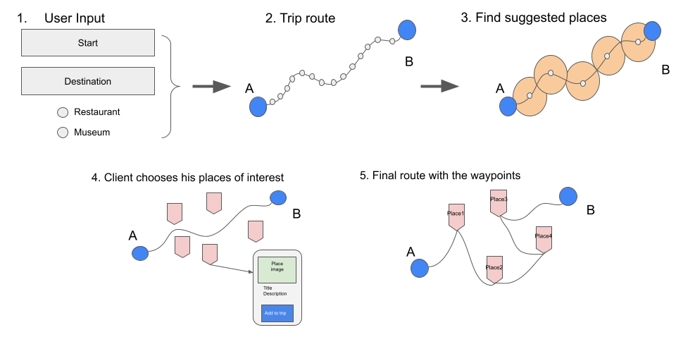
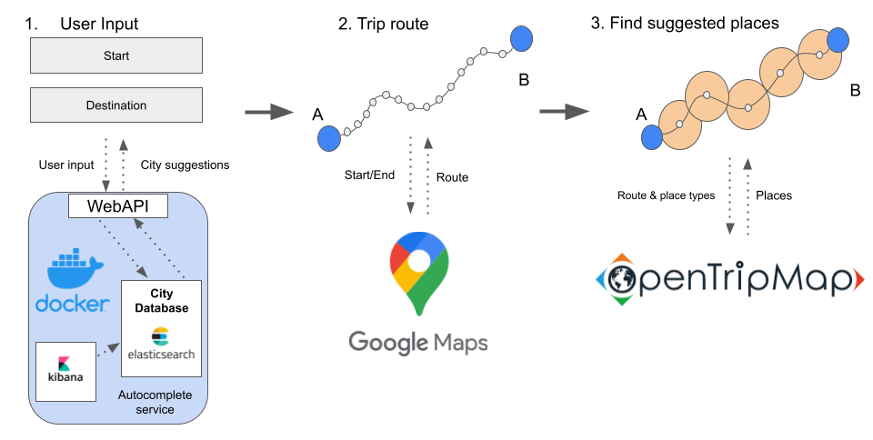
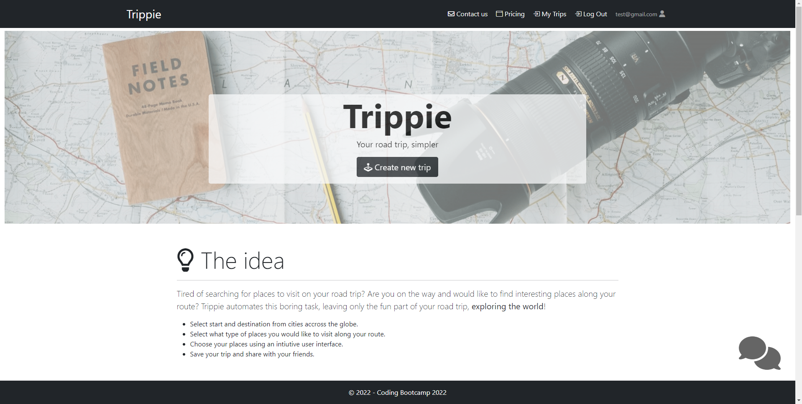
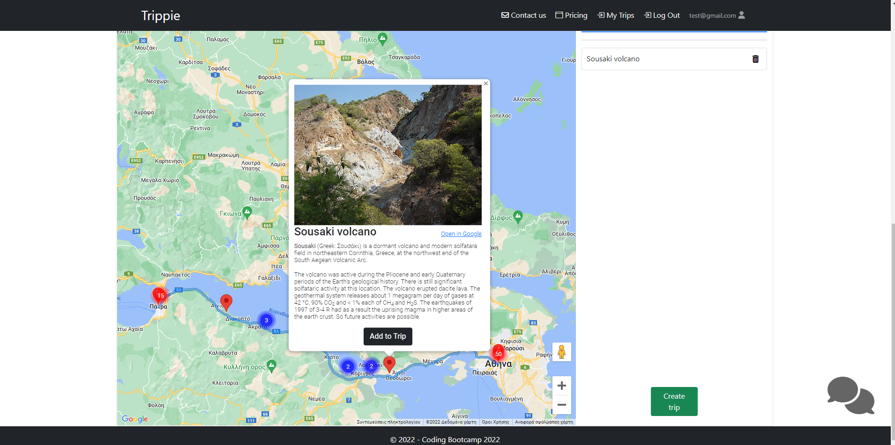
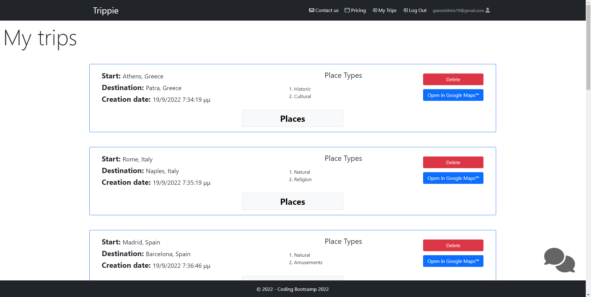
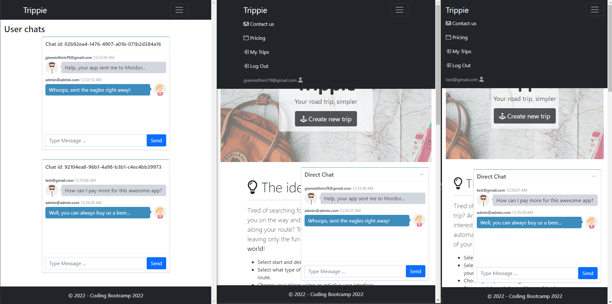

# Trippie

*Your road trip, simpler.*

Table of contents:

1. [Description](#description)
2. [Technical Implementation](#technical-implementation)
3. [Trip creation](#trip-creation)
4. [Screenshots](#screenshots)
5. [How to run](#how-to-run)
6. [Meet the team](#meet-the-team)

---

## Description

This application was built as a final group project for the [Peoplecert Coding Bootcamp](https://peoplecerteducation.org/bootcamp/), according to the requirements for its successful completion.

### What is Trippie?

Trippie is a web application that simplifies and automates some of the aspects of planning a road trip. In more detail, Trippie automates the boring task of finding interesting places along your route, leaving only the fun part of your road trip, exploring the world!

1. Select start and destination from cities across the globe.
2. Select what places types you would like to visit along your route.
3. Choose your places using an intuitive user interface.
4. Save your trip and share with your friends.

### Target group

The application is aimed, but not limited, to the following:

- People organizing a road trip
- Any car traveler who would like to enrich his journey with additional interesting places.

### Main Features

- **Global coverage**: Our solution is not exclusive to certain regions of the world.
- With over **10 million** places to choose, you can find what really matches your interests.
- With seamless integration with Google Maps™, you are ready to roll as soon as you create your trip.

#### Other features

- User registration/login, including Facebook and Google options.
- Unregistered users can try out the application.
- Registered users can save their trips to view them later.
- Unlock more trip options by paying with Paypal™ and becoming a Premium user.
- Admin role for viewing important data and statistics of the application.
- Autocomplete for the start/destination cities.
- Live chat for instant assistance.

## Technical Implementation

The application was built with ASP.NET MVC on .NET Framework 4.7.2. An overview of the technologies used is listed below.

### Frontend

The frontend of the application was built using HTML5, CSS3, vanilla JavaScript and Bootstrap.

For the maps and directions we used Google's [Maps JavaScript API](https://developers.google.com/maps/documentation/javascript), while for the places we used [OpenTripMap API](https://opentripmap.io/product).

The autocomplete feature was implemented through a basic **custom-made** [autocomplete service](https://github.com/ioannis-thyris/city-autocomplete), based on [Elasticsearch](https://www.elastic.co/guide/index.html). The service, which was developed for the purposes of this application, provides a basic free of charge combination of Google's [Place Autocomplete](https://developers.google.com/maps/documentation/places/web-service/autocomplete) and [Geocoding API](https://developers.google.com/maps/documentation/geocoding).

### Backend

Connection to the database was made with [Entity Framework 6](https://learn.microsoft.com/en-us/ef/ef6/), while a [Repository](https://dotnettutorials.net/lesson/repository-design-pattern-csharp/) design pattern was used to provide the necessary data to the controllers. Also, [LINQ](https://learn.microsoft.com/en-us/dotnet/csharp/programming-guide/concepts/linq/) was used to query the database, as well as when data manipulation was needed.

Authentication was achieved with the built-in authentication of ASP.NET MVC, using the solution template [Individual User Accounts](https://learn.microsoft.com/en-us/aspnet/mvc/overview/security/create-an-aspnet-mvc-5-web-app-with-email-confirmation-and-password-reset).

The live chat feature for instant messaging was implemented using [SignalR](https://learn.microsoft.com/en-us/aspnet/signalr/overview/getting-started/introduction-to-signalr) and the payment feature was achieved using [Paypal Sandbox](https://developer.paypal.com/tools/sandbox/), a simple environment to simulate real payments made through Paypal.

When necessary [Task asynchronous programming](https://learn.microsoft.com/en-us/dotnet/csharp/programming-guide/concepts/async/) was implemented in the controllers.

For data sent over API controllers and for data passed to Views, [Data Transfer Objects](https://learn.microsoft.com/en-us/aspnet/web-api/overview/data/using-web-api-with-entity-framework/part-5) (DTOs) and [View Models](https://learn.microsoft.com/en-us/aspnet/mvc/overview/older-versions/mvc-music-store/mvc-music-store-part-3) were used respectively.

The database used is a relational database on SQL Server.

### Other tools

Development was made primarily on Microsoft [Visual Studio 2022](https://visualstudio.microsoft.com/vs/), while version control system of choice was [Github](https://github.com/). Testing of the APIs was made with [Postman](https://www.postman.com/).

## Trip creation

The functionality of finding places of interest along the route of a road trip is described in the following schematic:

A more detailed illustration of the data transfer and manipulation happening under the hood is depicted below:

A request to the autocomplete service is made on user input and the city suggestions are returned. The user selects the start and destination cities of his trip and after selecting his preferred place types (and possibly other parameters), the route is returned from Google Maps API. Then, the corresponding places of interest along the route are returned from OpenTripMaps API, after reducing the initial route with a custom-made algorithm.

## Screenshots

Homepage             |  Trip creation
:-------------------------:|:-------------------------:
  |  

My Trips             |  Chat feature
:-------------------------:|:-------------------------:
  |  

## How to run

Follow the instructions to run the application:

1. Clone the repository.
2. In the `Web.config` change the *connection string* so that the "Data Source" matches your SQL Server.
3. Run [city-autocomplete](https://github.com/ioannis-thyris/city-autocomplete) service with Docker. (Please check the instructions in its repository on how to achieve this)
4. In the `CreateTrip` view replace the Google Maps API Key with your own (the existing key is now invalidated).
5. In the `PlacesController` replace your OpenTripMaps API Key with your own.
6. Run the application.

## Meet the team

- [Ioannis Thyris](https://github.com/ioannis-thyris)
- [Dimitris Zafeiris](https://github.com/zafeirisdimi)
- [Leonidas Mourikis](https://github.com/MourikisLeonidas)
- [Dimitrios Baltounas](https://github.com/GitEmm)
- [Stavros Gouleas](https://github.com/StaurosGouleas)
